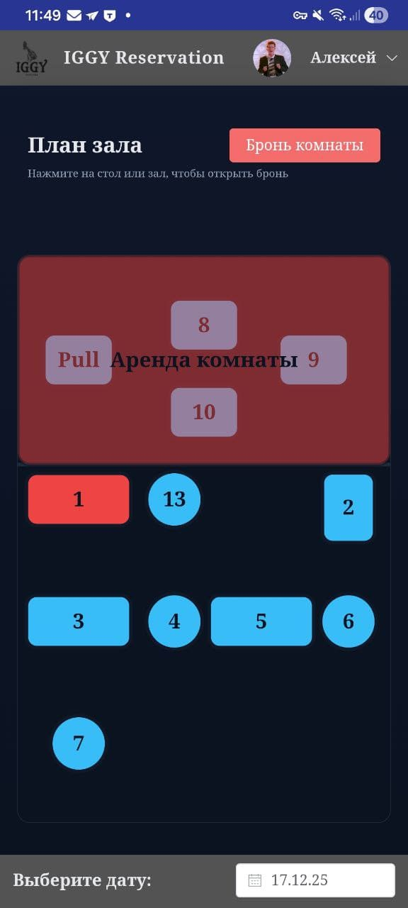
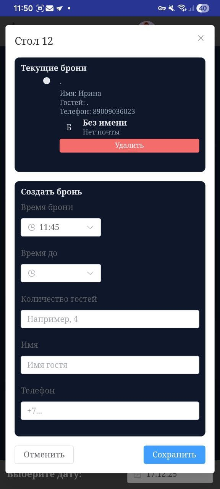
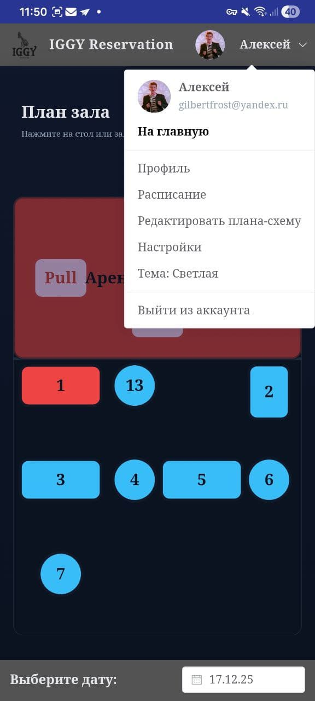
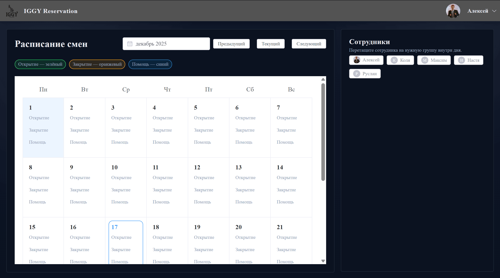

# Система бронирования Iggy

Комплексная система бронирования столов для бара Iggy Taproom, предназначенная для оптимизации управления бронированиями и улучшения клиентского опыта. Это изначально пэт-проект, но по итогу был приобретен, и теперь им регулярно пользуется организация из 10-15 человек.

## 📋 Содержание
- [Обзор проекта](#обзор-проекта)
- [Хронология развития](#хронология-развития)
- [Функции](#функции)
- [Технический стек](#технический-стек)
- [Интеграция с бэкендом](#интеграция-с-бэкендом)
- [Установка и настройка](#установка-и-настройка)
- [Скриншоты](#скриншоты)
- [Лицензия](#лицензия)

## Обзор проекта

Система бронирования Iggy - это надежное решение, разработанное для управления бронированием столиков в баре Iggy Taproom. Система обеспечивает отслеживание бронирований в реальном времени, управление расписанием и бесшовную интеграцию с уведомлениями Telegram для информирования персонала о новых бронированиях.

Созданная с использованием современных веб-технологий, система предлагает интуитивный интерфейс для управления персоналом и удобства для клиентов через Progressive Web App (PWA) с возможностями офлайн работы.

## Хронология развития

Проект прошел несколько итераций и постоянные улучшения, превратившись из базовой системы бронирования в комплексную платформу с расширенными функциями:

### Серия версий 1.x
- Первоначальная реализация с основными функциями бронирования столиков
- Добавлен Vuex для управления состоянием
- Интегрирован Supabase в качестве базы данных
- Реализовано основное пользовательское интерфейс с использованием Materialize CSS

### Серия версий 2.x
- Переход от Materialize к компонентам Element Plus UI
- Введение Vue 3 Composition API в дополнение к существующему Options API
- Добавлены возможности PWA со служебными работниками (service workers)
- Реализованы мгновенные уведомления Telegram для бронирований
- Улучшен пользовательский интерфейс с настраиваемым редактором схем для планировок столов
- Добавлены аутентификация пользователей и управление профилями

### Серия версий 3.x (Текущая)
- Обновления в реальном времени с использованием Socket.IO для мгновенной синхронизации
- Расширенное управление расписанием с назначением сотрудников
- Аутентификация по магической ссылке для упрощенного взаимодействия с пользователями
- Комплексная панель администратора с настройками управления
- Улучшения в представлении календаря с улучшенной адаптивностью для мобильных устройств
- Улучшенное цветовое кодирование и визуализация статусов столов
- Сохранение схемы с локальным хранилищем и интеграцией API

## Функции

### Основное управление бронированием
- 📅 Система бронирования столиков в режиме реального времени
- 🎨 Настраиваемая планировка столиков с цветовым кодированием доступности
- 📱 Адаптивный дизайн с мобильной версией
- 🔍 Фильтрация по дате и история бронирований

### Управление пользователями
- 👤 Аутентификация пользователей и управление профилями
- 🛡️ Контроль доступа на основе ролей
- 🔐 Аутентификация по магической ссылке

### Система уведомлений
- 💬 Интеграция с Telegram bot для уведомлений о бронировании в реальном времени
- 🔄 Мгновенная синхронизация между всеми подключенными устройствами

### Расширенное планирование
- 🗓️ Интерфейс управления расписанием с визуализацией
- 👨‍💼 Назначение сотрудников на определенные временные слоты
- 📅 Представление календаря с функцией перетаскивания
- ⏰ Выбор диапазона времени с точным контролем

### Инструменты администрирования
- ⚙️ Панель администратора для конфигурации системы
- 🎨 Редактор схем для настройки планировки столов
- 🔧 Интерфейс управления настройками
- 📊 Функции резервного копирования и восстановления

### Технические особенности
- 🚀 PWA (Прогрессивное веб-приложение) с возможностями работы в офлайне
- 🔄 Синхронизация в реальном времени через WebSocket
- 📐 Адаптивный дизайн для всех размеров устройств
- 🎯 Интуитивный пользовательский интерфейс с визуальной обратной связью

## Технический стек

### Фронтенд
- **Фреймворк**: Vue.js 3 с Options API и Composition API
- **UI Библиотека**: Element Plus
- **Управление состоянием**: Pinia (с поддержкой устаревшего Vuex)
- **Роутинг**: Vue Router 4
- **Сборка**: Vite
- **Стилизация**: SCSS/Sass с Normalize.css
- **Служебные работники**: Возможности PWA с Workbox
- **Генерация QR-кодов**: Библиотека QRCode

### Бэкенд
- **Среда выполнения**: Node.js
- **База данных**: SQLite (через серверную часть)
- **Аутентификация**: JWT токены
- **Связь в реальном времени**: Socket.IO

### Дополнительные библиотеки и инструменты
- **Генерация QR-кодов**: библиотека qrcode
- **Обновления в реальном времени**: socket.io-client
- **Контроль качества кода**: ESLint + Prettier

## Интеграция с бэкендом

Этот фронтенд подключается к специализированному серверу, созданному специально для этой системы бронирования:

🔗 **[Репозиторий бэкенд-сервера](https://github.com/StaburovAlexey/server-iggy-reserve)**

Серверная часть предоставляет:
- REST API для управления бронированиями
- Систему аутентификации на основе JWT
- Функциональность загрузки файлов для аватаров пользователей
- Интеграцию с Telegram bot для уведомлений
- Зашифрованное хранение настроек бота
- Систему автоматического резервного копирования
- Аутентификацию по магическим ссылкам

## Скриншоты

*Экран схемы столов с визуальным представлением доступных и забронированных позиций*

*Модальное окно для создания новой брони с детальной информацией*

*Выпадающее меню с дополнительными опциями и настройками*

*Адаптированное мобильное представление календаря для удобства на смартфонах*

*Интерфейс настроек для кастомизации и управления системой*

*Полнофункциональное десктопное представление календаря с расширенными возможностями*

---

Создано с ❤️ для команды Iggy Taproom

